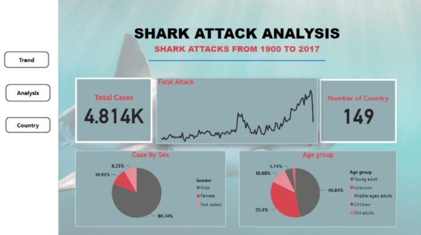
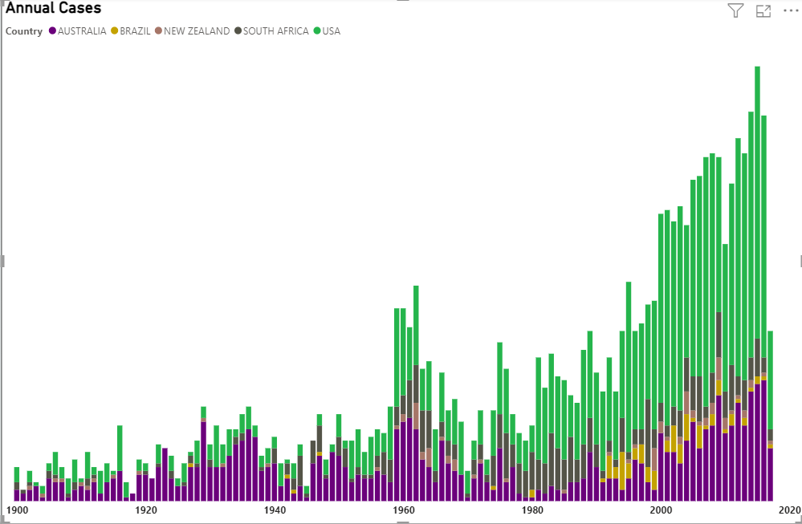
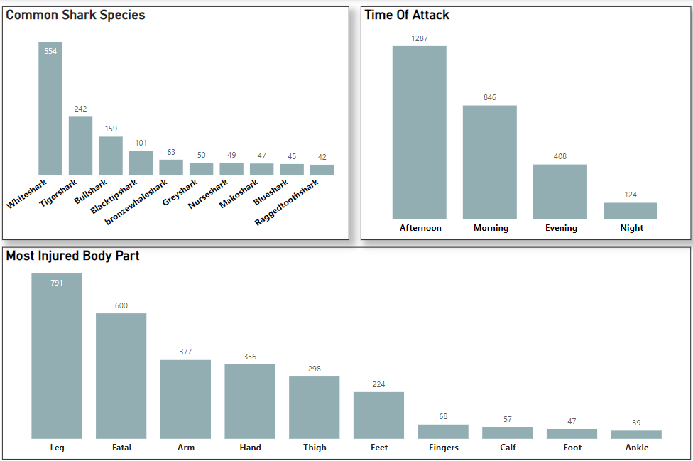
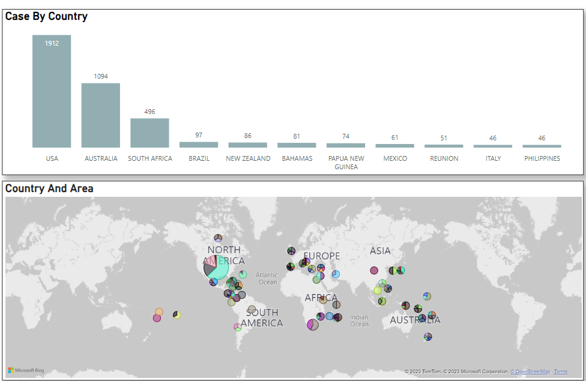

# Data-cleaning-in-power-BI
Shark attacks analysis between 1900-2017.

## Introduction
This is a data-cleaning project using power query. The data set is about world shark attacks and the data set was provided by Quantum-analytics 

## Project Objective
The project aims to anwser the following questions 
1. Trend of annual shark attacks
2. Which countries report the most shark attacks? Within those countries, which areas and 
    locations seem to be the most dangerous?
3. What body parts are most often injured?
4. what time of the day are attacks common?
5. Which species of shark are attacking most often?
   
## Analysis
Data cleaning was done in power query. The time, body type, and species column were dirty and were cleaned as follow;
The time column was trimmed and speacial characters were removed using the text.select function
(Text.Select([Time], {"A".."z"}))
A custom column was created using the following to convert different time zone to Morning, afternoon, eveining and Night
(if [Custom] = null then null
else if Value.Is([Custom], Time.Type) then
    if Time.Hour([Custom]) >= 6 and Time.Hour([Custom]) < 12 then "Morning"
    else if Time.Hour([Custom]) >= 12 and Time.Hour([Custom]) < 17 then "Afternoon"
    else if Time.Hour([Custom]) >= 17 and Time.Hour([Custom]) < 21 then "Evening"
    else "Night"
else [Custom])
A text analysis was performed on the injury and species column to extract key words from the columns

Visuals and Findings 

This shows there was a spike in attacks in the 1960s' and 2000s' specifically 2015. The visuals shows the trend of attacks over the years and the top five countries where it is prevelent. A drill down is applied to the chart to show the most dangerous areas and location.

This visual shows the most common species of shark, the most injured body parts and the common time of day for attacks.

